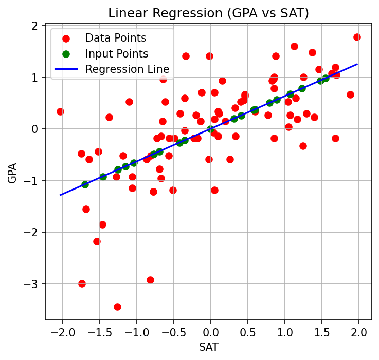

# machine-learning

## 1. SAT to GPA Predictor

A simple linear regression implementation from scratch to predict college GPA based on SAT scores.

### Overview

This project demonstrates how to build a linear regression model completely from scratch using only NumPy and basic Python. The model learns the relationship between SAT scores and GPA, then can predict a student's expected GPA given their SAT score.

### Features

- **From Scratch Implementation**: No machine learning libraries used
- **Manual Gradient Descent**: Custom optimization algorithm
- **Data Normalization**: Proper preprocessing for stable training
- **Visualization**: Plot of data points and regression line
- **Convergence Tracking**: Monitors training progress

### Files

- `linear_regression.py` - Core implementation (normalization, prediction, gradient descent)
- `main.py` - Training and visualization script
- `data.csv` - SAT to GPA dataset

### Usage

```python
# Train the model
python main.py

# Make a prediction
sat_score = 1800
predicted_gpa = predict(sat_score)  # Returns estimated GPA
```

### Plot



## 2. Diabetes Predictor

A machine learning model that predicts the likelihood of diabetes using patient health metrics.

### Overview

This project implements a classification model to assess diabetes risk based on key medical indicators. The system analyzes health parameters to provide early warning detection for diabetes.
Features

- Medical Indicator Analysis: Processes key health metrics including glucose levels, BMI, and age.
- Risk Assessment: Outputs probability scores for diabetes diagnosis.
- Data Preprocessing: Handles missing values and normalizes features.
- Model Evaluation: Comprehensive performance metrics and validation.
- Feature Importance: Identifies most influential health factors.

## Files

- `diabetes_predictor.py` - Core model implementation and training logic
- `preprocessing.py` - Data cleaning and feature engineering utilities
- `main.py` - Training, evaluation, and prediction script
- `dataset.csv` - Medical data containing health indicators and outcomes
- `evaluation.py` - Model performance analysis and visualization

### Usage

```python
# Make a prediction
patient_data = {
    'glucose': 148,
    'bmi': 33.6,
    'age': 50,
    'blood_pressure': 72
}
risk_score = predict_diabetes(patient_data)  # Returns probability between 0-1
```

## Model Details

The predictor uses a logistic regression approach:
text
```
P(diabetes) = σ(θ₀ + θ₁×glucose + θ₂×BMI + θ₃×age + ...)
```

Where $\sigma$ is the sigmoid function that outputs probabilities between 0 and 1.

## Key Health Indicators

- Glucose levels
- Body Mass Index (BMI)
- Age
- Blood pressure
- Insulin levels
- Skin thickness
- Diabetes pedigree function
- Number of pregnancies